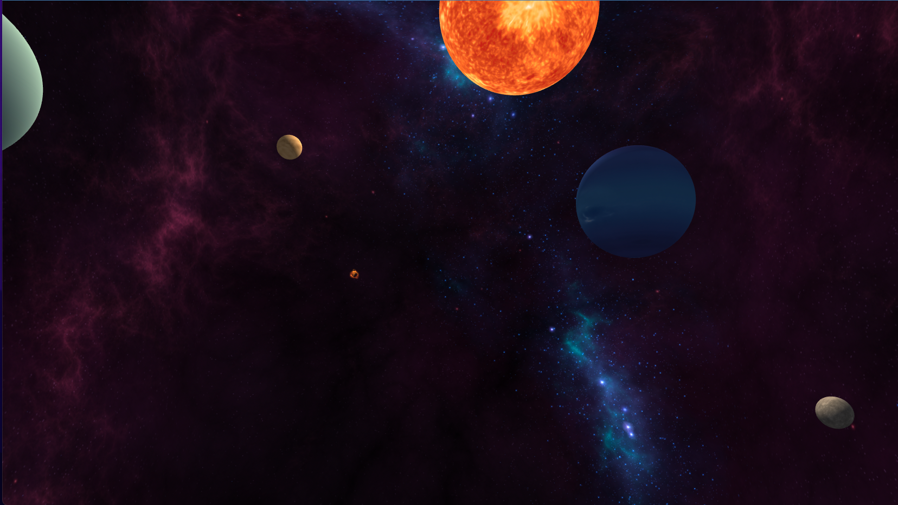
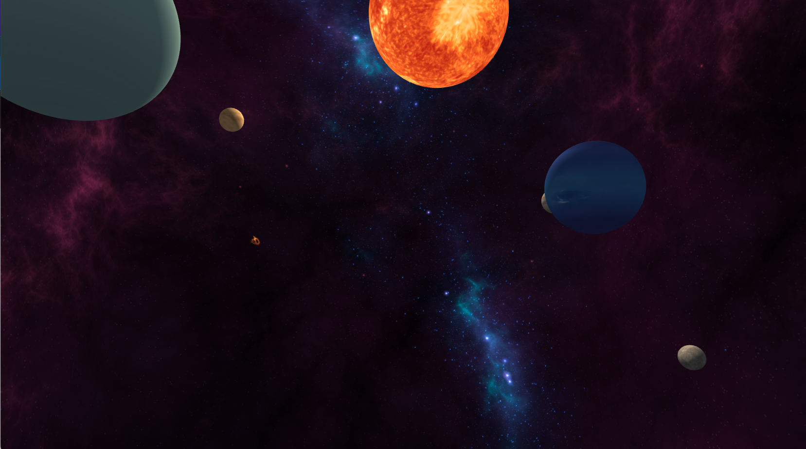
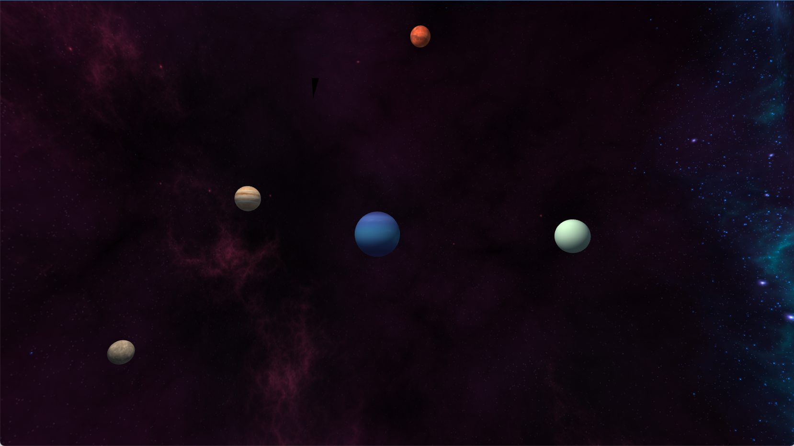

# Telescope Viewer

Es una escena que representa la mirada de un telescopio dentro del espacio. Se utilizo Three.js, framework de JavaScript con webGL para crearlo.

La escena tiene luces y sombras. Principalment la luz que genera el Sol afecta la ilumianción de todos los planetas.

Se observa un cometa rotar por el eje.

Tanto el Sky Box como cada planeta girando a una velocidad minima.

Es importante mencionar que NO es una replica del sistema solar, sino que se posicionaron los planetas al azar.

## Capturas

## Instalation

just double clic the index.html file to see the proyect on your browser.

## Referencias
- Sky box by [Calinou](https://opengameart.org/users/calinou) under CC license.
- Planets textures by [Solar System Scope](https://www.solarsystemscope.com/textures/).
- VolumetricFire (Fogata) de [yomotsu](https://github.com/yomotsu/VolumetricFire).

## Authors

- [@KevinDuenas](https://www.github.com/kevinduenas)

## Credits
- Sky box by [Calinou](https://opengameart.org/users/calinou) under CC license.
- Planets textures by [Solar System Scope](https://www.solarsystemscope.com/textures/).
- VolumetricFire (Fogata) de [yomotsu](https://github.com/yomotsu/VolumetricFire).

Space skybox files in this proyect, made by Ulukai (jonathan.denil@gmail.com), are
licensed under the Creative Commons Attribution-ShareAlike 3.0 Unported License.
To view a copy of this license, see cc-by-sa.txt or visit
http://creativecommons.org/licenses/by-sa/3.0/
